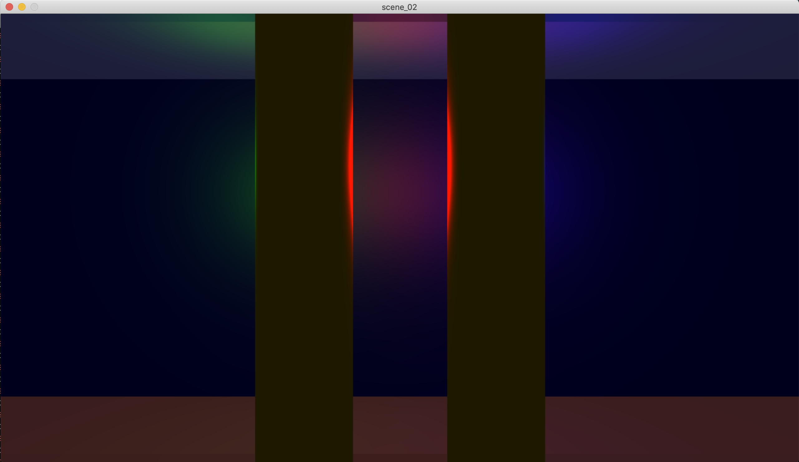
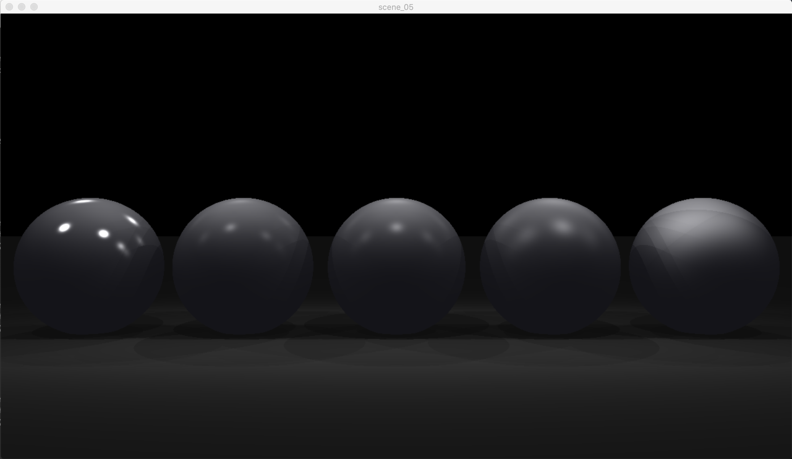

RTV1

This project’s goal is to be able, with the help of the program, to generate images according to Raytracing protocol.
Every generated image represents a scene, as seen from a specificangle and position, defined by simple geometric objects, 
and each with its own lightingsystem.
This project has been realized with another student.

__NOTE:__
The whole project was realized using the school's graphic library: MinilibX.
This library contains only basic drawing functions: open a window, lit a pixel and manage events.
Everything else must be coded by students. (ex. camera model, vector calculations, objects intersections equations...).

Mandatory functions:
- At least 4 simple geometric objects as a base (not composed)
- Position and direction of any point of vision
- Translation and rotation transformation before displaying
- Basic light management : different brightness, shadows

Realized bonus:
- Multi-spots
- Shine effect

_If you are interested to the complete code, please do not hesitate to contact me._
